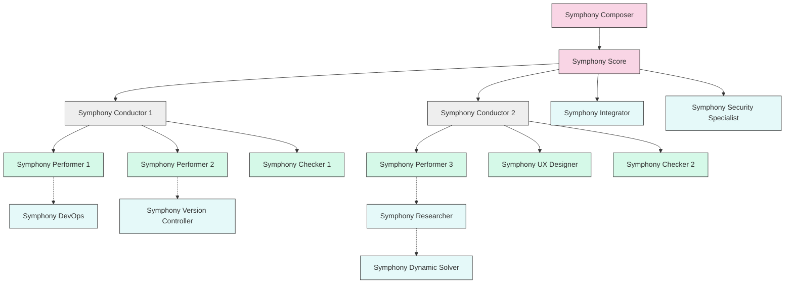

# Symphony v0.2: Multi-Agent Software Development Framework 🎼

<div align="center">
  


<h3>Orchestrated AI Software Development Framework</h3>

</div>

## Table of Contents

- [Introduction](#introduction)
- [Key Features](#key-features)
- [Architecture Overview](#architecture-overview)
- [Getting Started](#getting-started)
- [Usage Examples](#usage-examples)
- [User Command Interface](#user-command-interface)
- [Example Workflow](#example-workflow)
- [Command Reference](#command-reference)
- [Best Practices](#best-practices)
- [Limitations](#limitations)
- [FAQs](#faqs)

## Introduction

Symphony is a sophisticated multi-agent software development framework designed to orchestrate AI agents in a structured, efficient workflow. Inspired by the coordination of a musical orchestra, Symphony enables specialized AI agents to collaborate on complex software projects through well-defined roles, communication protocols, and file structures.

The core philosophy of Symphony is to bring **structure**, **traceability**, and **controlled automation** to AI-driven development. By breaking down complex projects into manageable goals and tasks, coordinating specialized agents, and meticulously documenting every step, Symphony enables teams to tackle ambitious projects with greater clarity, consistency, and quality assurance.

## Key Features

### 🎯 Specialized Agent Roles

Symphony implements a comprehensive set of specialized agent roles, each with expertise in specific aspects of software development:

- **Composer**: Visionary architect creating project specifications
- **Score**: Strategic planner breaking down specifications into goals
- **Conductor**: Tactical manager transforming goals into tasks
- **Performer**: Implementation specialist executing assigned tasks
- **Checker**: Quality assurance expert verifying implementations
- **Researcher**: Knowledge specialist for deep technical research
- **Integrator**: Integration expert ensuring components work together
- **Security Specialist**: Security expert for threat modeling and reviews
- **DevOps**: Infrastructure and deployment specialist
- **Dynamic Solver**: Complex analytical problem-solver
- **UX Designer**: User experience and interface design specialist
- **Version Controller**: Code versioning and release management expert

### 🔄 Structured Workflow

Symphony implements a clear, structured workflow that guides software development from conception to delivery:

1. **Vision & Architecture**: Composer establishes project vision and core architecture
2. **Strategic Planning**: Score breaks down the vision into strategic goals
3. **Tactical Management**: Conductor transforms goals into sequential tasks
4. **Implementation**: Specialized agents execute tasks according to specifications
5. **Verification**: Quality assurance ensures implementation meets requirements
6. **Integration**: Components are integrated into a coherent whole
7. **Delivery**: The complete system is prepared for deployment

### 📁 Standardized Project Structure

Symphony agents operate within a carefully designed file structure that organizes project artifacts, communication, and documentation:

```
symphony-[project-slug]/
├── core/                  # Core system configuration
├── specs/                 # Project specifications and architecture
├── planning/              # Strategic goals and planning artifacts
├── tasks/                 # Task breakdowns and assignments
├── logs/                  # Work logs and progress tracking
├── communication/         # Agent interaction records
├── testing/               # Test plans and results
├── security/              # Security requirements and reviews
├── integration/           # Integration specifications and tests
├── research/              # Research reports and findings
├── design/                # UX/UI design artifacts
├── knowledge/             # Knowledge base and learning artifacts
├── documentation/         # Project documentation
├── version-control/       # Version control strategies
└── handoffs/              # Continuity documents for agent transitions
```

### 🤝 Intelligent Collaboration

Symphony agents collaborate through a standardized communication protocol that enables:

- Clear delegation of responsibilities
- Structured reporting of results
- Managed task dependencies
- Escalation paths for issues
- Knowledge sharing across agents

### 🔍 Comprehensive Documentation

The framework emphasizes thorough documentation at every stage:

- Detailed project specifications
- Strategic goal breakdowns
- Task requirements and acceptance criteria
- Implementation logs and rationales
- Test plans and results
- Visual representations (diagrams) of architecture and workflows

### 🔧 Adaptive Automation Levels

Symphony supports three automation levels that control how independently agents operate:

- **Low**: Requires explicit human approval for delegation and user commands
- **Medium**: Allows delegation but requires approval for user commands
- **High**: Permits autonomous delegation and user command execution

## Architecture Overview

Symphony's architecture is designed around specialized agent roles that work together in a hierarchical structure:



Communication flows both upward and downward through this hierarchy, with specialized support agents providing cross-cutting expertise as needed.

## Getting Started

### Prerequisites

- Roo Code
- Basic understanding of software development principles
- Project requirements or specifications to start with

### Initial Setup

1. **Drop the .roo folder into your workspace**

2. **Copy the contents of `custom_modes.json` to your global or project mode configuration**  

3. **Start with the Composer**:
   Begin by describing your project to the `Composer`.

## Usage Examples

### Example 1: Project Initialization with Symphony Composer

**Prompt to `Composer`**:
```
I need a web application that allows users to track their daily exercises, view progress over time, and receive personalized workout recommendations. Please create an initial project specification and architecture design.
```

**Expected Response**:
```
I'll help you create the initial project specification and architecture for your exercise tracking web application. Let me start by gathering the key requirements and defining the high-level architecture.

First, I'll create the project specification:

[Creates symphony-exercise-tracker/specs/project-specification.md with detailed content]

Next, I'll create the initial architecture diagrams:

[Creates symphony-exercise-tracker/specs/architecture-diagrams.md with C4 model diagrams in Mermaid]

I've established the core architectural decisions:
- Progressive web app with responsive design for cross-device usage
- React frontend with Material UI components
- Node.js/Express backend with RESTful API
- MongoDB for storing user profiles and workout data
- Authentication using JWT tokens
- Recommendation engine using simple ML-based approach

I've also initialized the core Symphony file structure and set the initial automation level to "medium".

Now, I'll delegate the strategic planning to Symphony Score to break down this specification into actionable goals and create the initial project map visualization.
```

### Example 2: Task Delegation with Symphony Conductor and Symphony Performer

**Delegation from `Conductor` to `Performer`**:
```
You've been assigned Task-ID GOAL-02-TASK-03 to implement the user authentication service with JWT token generation and validation. Please analyze the task and implement the solution.
```

**Expected Response**:
```
I'll implement the user authentication service with JWT token generation and validation as assigned in GOAL-02-TASK-03. Let me start by analyzing the task requirements.

First, I'll check the task details:

[Reads symphony-exercise-tracker/tasks/goal-02/goal-02-sheet.md]

Now, I'll initialize my work log:

[Creates symphony-exercise-tracker/logs/goal-02-task-03/goal-02-task-03-work-log.md]

Let me also check the related specifications and security requirements:

[Reads relevant specification and security requirement files]

Based on my analysis, I'll implement a Node.js authentication service with the following components:
1. User registration endpoint
2. User login endpoint with JWT token generation
3. Token validation middleware
4. Password hashing with bcrypt
5. Token refresh mechanism

Here's my implementation plan:
[Details sequential implementation steps]

[Implements the solution with appropriate code files outside symphony structure]

I've completed self-verification of the implementation:
- Tested user registration with validation
- Tested login and token generation
- Verified token validation middleware
- Confirmed secure password storage with bcrypt
- Tested token refresh flow

All deliverables are now complete. I'm notifying the Conductor that Task-ID GOAL-02-TASK-03 is ready for review and testing.
```

## User Command Interface

Symphony's user command interface allows direct interaction with agents through standardized commands. Commands always begin with a forward slash (`/`) followed by the command name and any required parameters.

### User Command Examples

#### Example 1: Checking Task Status with Conductor

**Prompt to Symphony Conductor**:
```
/task-list
```

**Expected Response**:
```
Here's the current task list for GOAL-02 (User Authentication & Profile Management):

| Task ID | Description | Status | Assigned to | Dependencies |
|---------|-------------|--------|-------------|--------------|
| GOAL-02-TASK-01 | Design user data model | Complete | symphony-performer | None |
| GOAL-02-TASK-02 | Implement user registration API | Testing | symphony-checker | GOAL-02-TASK-01 |
| GOAL-02-TASK-03 | Implement JWT authentication | Complete | symphony-performer | GOAL-02-TASK-01 |
| GOAL-02-TASK-04 | Create profile management API | Assigned | symphony-performer | GOAL-02-TASK-01 |
| GOAL-02-TASK-05 | Implement frontend login component | Not Started | N/A | GOAL-02-TASK-03 |
| GOAL-02-TASK-06 | Implement frontend profile component | Not Started | N/A | GOAL-02-TASK-04 |
| GOAL-02-TASK-07 | Integration testing | Not Started | N/A | GOAL-02-TASK-02, GOAL-02-TASK-03, GOAL-02-TASK-04 |

Is there a specific task you'd like more details on? You can use /task-details [task-id] to see full information.
```

#### Example 2: Requesting Security Review

**Prompt to Symphony Security Specialist**:
```
/code-review src/auth/authService.js
```

**Expected Response**:
```
I'll perform a security code review on src/auth/authService.js.

[Reads the file and performs analysis]

Security Review Results for src/auth/authService.js:

✅ Strong Points:
- Password hashing using bcrypt with appropriate cost factor
- JWT tokens configured with expiration
- Input validation before authentication attempts
- No hardcoded secrets (using environment variables)

⚠️ Security Issues:
1. [MEDIUM] Line 45: JWT token expiration time (24h) is excessive. Recommend reducing to 1-2 hours with refresh token pattern.
2. [HIGH] Line 62: Missing rate limiting on login attempts, creating vulnerability to brute force attacks.
3. [LOW] Line 78: Verbose error messages may reveal too much information about system structure.

🛡️ Recommendations:
1. Implement rate limiting on login endpoint (max 5-10 attempts per IP)
2. Reduce JWT expiration time and implement refresh token pattern
3. Make error messages generic ("Authentication failed") without details
4. Add CSRF protection for authentication endpoints
5. Consider adding two-factor authentication support

I've documented these findings in symphony-exercise-tracker/security/reviews/code-reviews-goal-02-task-03.md for reference.
```

#### Example 3: Generating Project Map with Score

**Prompt to Symphony Score**:
```
/project-map
```

**Expected Response**:
```
Here's the current project map for the Exercise Tracker application:

```mermaid
graph TD
    GOAL-01[GOAL-01: System Architecture Setup] --> GOAL-02[GOAL-02: User Authentication & Profile Management]
    GOAL-01 --> GOAL-03[GOAL-03: Exercise Database & Tracking]
    GOAL-02 --> GOAL-04[GOAL-04: Dashboard & Visualization]
    GOAL-03 --> GOAL-04
    GOAL-02 --> GOAL-05[GOAL-05: Workout Recommendation Engine]
    GOAL-03 --> GOAL-05
    GOAL-04 --> GOAL-06[GOAL-06: Mobile Responsiveness & Progressive Web App]
    GOAL-05 --> GOAL-06
    GOAL-06 --> GOAL-07[GOAL-07: Deployment & CI/CD Pipeline]
    
    classDef complete fill:green,stroke:#333,stroke-width:1px;
    classDef inProgress fill:yellow,stroke:#333,stroke-width:1px;
    classDef notStarted fill:gray,stroke:#333,stroke-width:1px;
    
    class GOAL-01 complete;
    class GOAL-02,GOAL-03 inProgress;
    class GOAL-04,GOAL-05,GOAL-06,GOAL-07 notStarted;

    Current status summary:
   - Completed: 1/7 goals (14%)
   - In Progress: 2/7 goals (29%)
   - Not Started: 4/7 goals (57%)

   Would you like more details on any specific goal? 
```

## Example Workflow

Here's a complete example workflow showing how Symphony agents collaborate on a project:

### 1. Project Initialization (Composer)

The Composer agent analyzes requirements, creates project specifications, architectural diagrams, and initializes the Symphony file structure.

### 2. Strategic Planning (Score)

The Score agent breaks down the project into strategic goals:

- GOAL-01: System Architecture Setup
- GOAL-02: User Authentication & Profile Management
- GOAL-03: Exercise Database & Tracking
- GOAL-04: Dashboard & Visualization
- GOAL-05: Workout Recommendation Engine
- GOAL-06: Mobile Responsiveness & PWA Features
- GOAL-07: Deployment & CI/CD Pipeline

Each goal has clear success criteria, dependencies, and an initial assignment to a Conductor.

### 3. Tactical Planning (Conductor)

The Conductor for GOAL-02 breaks it down into sequential tasks:

- GOAL-02-TASK-01: Design user data model
- GOAL-02-TASK-02: Implement user registration API
- GOAL-02-TASK-03: Implement JWT authentication
- GOAL-02-TASK-04: Create profile management API
- GOAL-02-TASK-05: Implement frontend login component
- GOAL-02-TASK-06: Implement frontend profile component
- GOAL-02-TASK-07: Integration testing

The Conductor creates a visualization of the task sequence and dependencies.

### 4. Implementation (Performer)

The assigned Performer implements GOAL-02-TASK-03 (JWT authentication):
- Analyzes requirements
- Documents approach in work log
- Implements solution
- Performs self-verification
- Notifies Conductor of completion

### 5. Quality Assurance (Checker)

The Checker:
- Creates test plan based on requirements
- Reviews implementation
- Executes test cases
- Documents results
- Reports back to Conductor (pass/fail)

### 6. Security Review (Security Specialist)

The Security Specialist:
- Reviews the authentication implementation
- Provides security recommendations
- Verifies security controls
- Documents findings in security review

### 7. Integration (Integrator)

The Integrator:
- Updates integration registry with this component
- Verifies interfaces match specifications
- Coordinates integration testing
- Reports integration status

### 8. Progress Tracking (Score)

The Score agent:
- Updates project status based on Conductor reports
- Updates project visualization
- Identifies the next goals to start based on dependencies
- Reports progress to Composer

### 9. Completion (Composer)

The Composer:
- Reviews final project status
- Conducts final architecture review
- Documents lessons learned
- Confirms project completion

## Command Reference

Symphony agents support a variety of user commands. Here are the most commonly used commands across agents:

### Common Commands

| Command | Description | Example |
|---------|-------------|---------|
| `/help` | Display available commands and information | `/help` |
| `/continue` | Initiates handoff to a new agent instance | `/continue` |
| `/escalate "issue"` | Escalate an issue to a higher-level agent | `/escalate "Security vulnerability found"` |
| `/delegate-to [agent] "task"` | Delegate a task to another agent | `/delegate-to symphony-security "Review authentication"` |
| `/request-review "path"` | Request review of a specific artifact | `/request-review "src/auth/login.js"` |
| `/set-automation [level]` | Set the automation level (human only) | `/set-automation medium` |

### Score Commands

| Command | Description | Example |
|---------|-------------|---------|
| `/status` | Display current project status summary | `/status` |
| `/project-map` | Show visual project goal map | `/project-map` |
| `/goal-breakdown` | Display strategic goals breakdown | `/goal-breakdown` |
| `/assign goal-id agent-id` | Assign a goal to a specific conductor | `/assign goal-02 conductor-1` |
| `/risk-analysis` | Generate high-level risk assessment | `/risk-analysis` |

### Conductor Commands

| Command | Description | Example |
|---------|-------------|---------|
| `/task-list` | Display tasks with statuses | `/task-list` |
| `/task-details task-id` | Show details for specific task | `/task-details goal-02-task-03` |
| `/sequence-plan` | Display planned task sequence | `/sequence-plan` |
| `/blockers` | List blocked or failed tasks | `/blockers` |
| `/progress-report` | Generate goal progress report | `/progress-report` |

### Performer Commands

| Command | Description | Example |
|---------|-------------|---------|
| `/work-log` | Show work log contents | `/work-log` |
| `/implementation-plan` | Show implementation steps | `/implementation-plan` |
| `/self-test` | Run verification tests | `/self-test` |
| `/code-details` | Explain code implementation | `/code-details` |
| `/documentation` | Generate implementation docs | `/documentation` |

### Checker Commands

| Command | Description | Example |
|---------|-------------|---------|
| `/test-plan` | Display the test plan | `/test-plan` |
| `/test-results` | Show test report summary | `/test-results` |
| `/issues` | List discovered issues | `/issues` |
| `/run-test-case "case-id"` | Execute specific test | `/run-test-case "auth-tc-03"` |
| `/security-scan` | Run security-focused tests | `/security-scan` |

### Security Specialist Commands

| Command | Description | Example |
|---------|-------------|---------|
| `/threat-model` | Display the threat model | `/threat-model` |
| `/security-requirements` | Show security requirements | `/security-requirements` |
| `/code-review path` | Perform security code review | `/code-review src/auth/login.js` |
| `/vulnerability-scan "target"` | Run vulnerability scan | `/vulnerability-scan "authentication-api"` |
| `/risk-assessment "component"` | Perform risk assessment | `/risk-assessment "payment-processing"` |

### Integrator Commands

| Command | Description | Example |
|---------|-------------|---------|
| `/integration-map` | Display the integration map | `/integration-map` |
| `/integration-status` | Show integration status | `/integration-status` |
| `/integration-details id` | Show specific integration | `/integration-details auth-api-frontend` |
| `/verify-flow "description"` | Analyze interaction flow | `/verify-flow "login sequence"` |
| `/integration-risks` | List integration risks | `/integration-risks` |

### Researcher Commands

| Command | Description | Example |
|---------|-------------|---------|
| `/research "topic"` | Begin research investigation | `/research "GraphQL vs REST"` |
| `/search "query"` | Perform focused search | `/search "best JWT practices 2023"` |
| `/compare "option1" "option2"` | Compare alternatives | `/compare "MongoDB" "PostgreSQL"` |
| `/recommend "problem"` | Get evidence-based recommendations | `/recommend "scaling websockets"` |
| `/literature-review "topic"` | Conduct literature review | `/literature-review "microservices"` |

## Best Practices

### Communication

1. **Explicit Hand-offs**: When transitioning work between agents, provide clear context and expectations.
2. **Clear Escalation Paths**: Use the `/escalate` command when issues cannot be resolved within the current context.
3. **Utilize *user commands* to quickly perform actions**: This can cut down on time spent describing similar tasks across the length of execution of a project.

## Limitations

While Symphony offers a powerful framework for organizing AI-driven software development, users should be aware of these limitations:

1. **Sequential Execution Focus**: Symphony is designed around sequential task execution, which may not be optimal for highly parallel development workflows.

2. **Document-Centric Approach**: The framework relies heavily on document generation and management, which may feel bureaucratic for smaller projects.

3. **Integration Complexity**: Coordinating multiple specialized agents requires careful management of interfaces and communications.

4. **Learning Curve**: The extensive set of agents, commands, and protocols requires time to learn and use effectively.

## FAQs

**Q: Is Symphony suitable for small projects?**  
A: While Symphony can be used for projects of any size, its comprehensive structure may introduce overhead that's more beneficial for medium to large projects with multiple components and team members.

**Q: Can I use only some of the Symphony agents?**  
A: Yes, Symphony is designed to be flexible. You can start with a core set of agents (e.g., Composer, Score, Conductor, Performer, Checker) and introduce specialists as needed.

**Q: How do I handle agent context limitations?**  
A: Symphony includes built-in mechanisms for context management, including the `/continue` command which facilitates handoffs between agent instances when context limits are approached.

**Q: Can Symphony integrate with existing version control systems?**  
A: Yes, the Symphony Version Controller agent is designed to work with standard version control systems like Git through the `execute_command` interface.

**Q: How does Symphony ensure security throughout the development process?**  
A: The Symphony Security Specialist agent is dedicated to security concerns, from initial threat modeling to code reviews, ensuring security is integrated throughout the development lifecycle.

**Q: Can Symphony agents work with human developers?**  
A: Absolutely. Symphony is designed to support varying levels of automation and collaboration with human developers through its configurable automation levels.

---

<div align="center">
  
Symphony: Orchestrating AI Agents for Seamless Software Development
  
</div>
